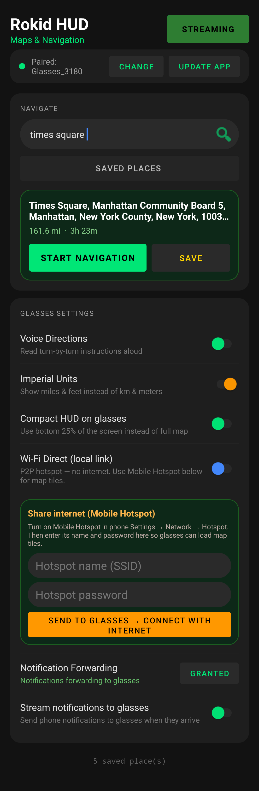
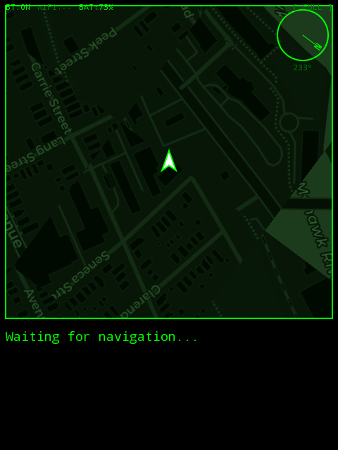
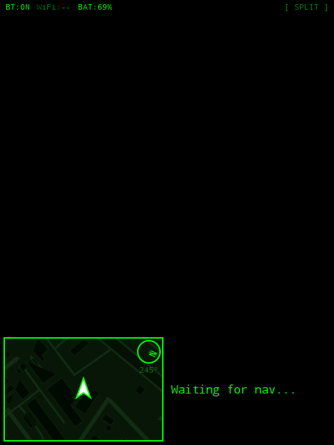
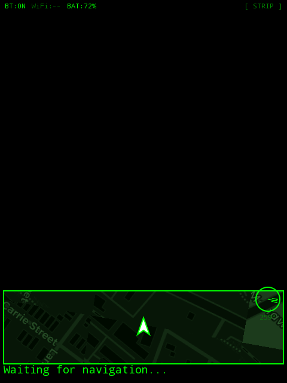

# Rokid HUD Maps

**[🌐 Live Demo & Landing Page](https://chartmann1590.github.io/Rokid-Maps/)**

<a href="https://buymeacoffee.com/charleshartmann"></a>

Turn-by-turn navigation on your Rokid AR glasses, powered by your phone.

Your phone handles all the heavy lifting — GPS, route calculations, address search — and streams everything to your glasses over Bluetooth. You get a live map with your route drawn on it, step-by-step directions, and even your phone notifications, all floating in your field of view. No cloud services, no API keys, no subscriptions. It's all free and open-source under the hood.

## How It Works

There are two apps: one runs on your Android phone, the other on your Rokid glasses. They talk to each other over Bluetooth SPP (Serial Port Profile), sending JSON messages back and forth — one per line, nice and simple.

The phone is the brain. It grabs your GPS location once per second, calculates routes using [OSRM](http://project-osrm.org/) (a free routing engine), and searches for addresses with [Nominatim](https://nominatim.openstreetmap.org/) (OpenStreetMap's geocoder). When you start streaming, the phone opens a Bluetooth server and waits for your glasses to connect. Once they do, everything flows automatically.

The glasses are the display. They render a dark-themed map (CartoDB Dark Matter tiles with a green tint — looks great on AR glass), show your current navigation step, draw your route, and rotate the map to match the direction you're facing. If the glasses don't have Wi-Fi for downloading map tiles, the phone acts as a proxy — the glasses request tiles over Bluetooth, the phone fetches them from the internet, and sends them back.

```
┌──────────────────────────┐    Bluetooth SPP     ┌──────────────────────────┐
│       Phone App          │ ◄──────────────────►  │      Glasses App         │
│                          │   JSON messages       │                          │
│  GPS tracking @ 1Hz      │   + tile proxy        │  Live rotating map       │
│  OSRM routing            │   + APK updates       │  Turn-by-turn HUD        │
│  Nominatim search        │   + settings sync     │  Route line overlay      │
│  Overpass speed limits   │   + tile caching      │  Phone notifications     │
│  BT server + A2DP audio  │                       │  Speed + speed limit     │
│  TTS voice directions    │                       │  3 layout modes          │
└──────────────────────────┘                       └──────────────────────────┘
```

## What You Can Do

### On the Phone

- **Search for places** — Type an address or place name and pick from the results. Uses OpenStreetMap data, no API key needed.
- **Get turn-by-turn directions** — Routes are calculated with OSRM. If you go off-route, it automatically recalculates. When you arrive, it tells you.
- **See a map while navigating** — The phone shows a map and live directions while you're navigating (hides when you're not, keeps the UI clean).
- **Save places** — Found a spot you like? Save it. Long-press to delete. Simple.
- **Voice directions** — TTS reads out your turns and routes audio to your glasses via Bluetooth A2DP. Toggle it in settings.
- **Forward notifications** — Your texts, emails, whatever — they show up on your glasses. Requires notification access permission.
- **Push app updates to glasses** — Pick an APK file on your phone and send it to the glasses over Bluetooth. No need to plug in a cable or use ADB (though you still can if you want).
- **Share internet with glasses** — Send your phone's hotspot credentials to the glasses so they can download map tiles directly instead of going through the Bluetooth proxy.
- **Imperial or metric** — Your choice.
- **Mini map mode** — Toggle from the phone to switch the glasses to a compact layout: small map at the bottom, just the direction and distance, no notifications.
- **Show speed on glasses** — Toggle to display your current speed in the glasses status bar. Respects your imperial/metric setting.
- **Show speed limit on glasses** — Toggle to display the road's speed limit next to your speed. When you exceed the limit, a warning indicator appears.
- **Turn alert on glasses** — Toggle to show a large turn overlay on the glasses when approaching a turn (within 200m). Auto-dismisses after the turn.
- **Map tile cache** — Configurable disk cache (50/100/200/500 MB) for map tiles on both phone and glasses. Tiles load from cache on subsequent visits. Clear cache button with real-time usage display.
- **Keeps running in the background** — Uses a WakeLock so your GPS and Bluetooth keep working when the phone screen turns off. It'll ask about battery optimization so Android doesn't kill it.

### On the Glasses

- **Live map** — Rotates with your heading, renders dark-themed tiles with a green HUD overlay. If there's no Wi-Fi, tiles come through the phone via Bluetooth.
- **Navigation display** — Shows the current instruction, maneuver arrow, and distance to the next turn. Shows a checkmark and "You have arrived!" when you get there.
- **Route line** — Your full route drawn on the map with a glowing green line.
- **Compass** — Shows which way is north and your current bearing in degrees.
- **Three layouts** — Tap the screen to cycle between Full and Corner. Mini mode is toggled from the phone with two styles (strip or split):
  - **Full** — Map takes up ~72% of the screen, directions and notifications below
  - **Corner** — Small map in the bottom-right corner, text on the left
  - **Mini** — Compact strip at the bottom (toggled from phone settings, choose between strip or split style)
- **Phone notifications** — Scrolling list below the directions, shows title and preview text.
- **Speed display** — Current speed shown in the status bar (mph or km/h depending on your units setting). Toggleable from the phone. If a speed limit is known and you exceed it, a `!` warning prefix appears next to your speed.
- **Speed limits** — Automatically fetched from the [Overpass API](https://overpass-api.de/) (free, no API key). Queried every 15 seconds or 200m, non-blocking. Toggleable from the phone.
- **Monochrome green display** — The entire HUD renders in shades of green only, matching the monochrome display of Rokid AR glasses. Map tiles are converted to green luminance.
- **Turn alert overlay** — When enabled, a large semi-transparent overlay appears in the center of the glasses screen when you're within 200m of a turn, showing the maneuver arrow, distance, and instruction.
- **Live distance countdown** — The distance to the next turn updates in real-time as you move, not just when the step changes.
- **Earlier turn notifications** — Step advances happen at ~150m from the next turn instead of 45m, giving you more time to prepare.
- **Disk tile cache** — Map tiles are cached to disk for faster loading on subsequent visits. Cache size is configurable from the phone.
- **Status indicators** — BT, Wi-Fi, battery, and speed in the top-left corner.
- **Auto-connect Wi-Fi** — When the phone sends hotspot credentials, the glasses automatically enable Wi-Fi and connect.
- **Close the app** — Tap the temple (on many devices a single tap is enough). The app shows **"Rokid Maps is closing"** on screen, then exits and stops running. No background process left behind.

## Screenshots

### Phone app

The phone app handles search, routing, and streaming to the glasses. When navigating, it shows a map and turn-by-turn directions; you can toggle the full list of route steps and control what gets sent to the glasses (mini map, notifications).



### Glasses HUD

On the glasses you get a live map, route line, compass, and directions. Tap the screen to cycle layout; tap the temple to close the app (you’ll see "Rokid Maps is closing" first).

| Full-screen map | Corner layout | Mini bottom (phone toggle) |
|-----------------|---------------|----------------------------|
|  |  |  |

More examples: [4](screenshots/glasses/glasses_screenshot_4.png), [5](screenshots/glasses/glasses_screenshot_5.png), [6](screenshots/glasses/glasses_screenshot_6.png).

## Project Structure

```
rokid-maps/
├── shared/    Bluetooth protocol — message types, JSON encoding/decoding, disk tile cache
├── phone/     Phone app — search, routing, streaming service, BT server, speed limit client
└── glasses/   Glasses app — HUD rendering, BT client, tile manager, turn alert overlay
```

## Building

### What You Need

- JDK 17+
- Android SDK (API 34)

### Rokid SDK (Optional)

The app can optionally use the Rokid CXR SDK for device features. If you have Rokid developer credentials, put them in `local.properties`. If you don't, everything still works — Bluetooth pairing uses standard Android APIs.

### Setup

1. Clone the repo
2. Copy `local.properties.template` to `local.properties`
3. Set your Android SDK path. Optionally add your own Rokid credentials:

```properties
sdk.dir=C\:\\Users\\YOU\\AppData\\Local\\Android\\Sdk
rokid.client.id=YOUR_CLIENT_ID
rokid.client.secret=YOUR_CLIENT_SECRET
rokid.access.key=YOUR_ACCESS_KEY
```

**Don't commit `local.properties`** — it's already in `.gitignore`.

### Build

```bash
./gradlew assembleDebug
```

APKs end up in:
- `phone/build/outputs/apk/debug/phone-debug.apk`
- `glasses/build/outputs/apk/debug/glasses-debug.apk`

### Glasses Wi-Fi Permission (Some Devices)

If Wi-Fi toggling doesn't work on your glasses, grant this via ADB:

```bash
adb shell pm grant com.rokid.hud.glasses android.permission.WRITE_SECURE_SETTINGS
```

## Installing

- **Phone** — Install the phone APK like any other Android app.
- **Glasses** — Either use `adb install -r glasses-debug.apk`, or use the phone app's "Update app" button to send it over Bluetooth.

## The Protocol

Everything goes over Bluetooth SPP as one JSON object per line. Here's what gets sent:

| Message | What It Does |
|---------|-------------|
| `state` | GPS position, bearing, speed, accuracy, speed limit, distance to next step — sent once per second |
| `route` | Full list of waypoints, total distance and duration |
| `step` | Current instruction, maneuver type, distance to next turn |
| `settings` | TTS on/off, imperial/metric, mini map toggle, turn alert, show speed, show speed limit, tile cache size |
| `steps_list` | Full list of upcoming navigation steps with current step index |
| `wifi_creds` | Hotspot SSID and password for the glasses to connect |
| `tile_req` / `tile_resp` | Glasses ask for a map tile, phone fetches and returns it |
| `apk_start` / `apk_chunk` / `apk_end` | Glasses app update sent in chunks from the phone |
| `notification` | Forwarded phone notification with title, text, and source app |

## What It Uses

All free, all open-source:

- **[OSRM](http://project-osrm.org/)** — Routing engine (no API key)
- **[Nominatim](https://nominatim.openstreetmap.org/)** — Address search (no API key)
- **[Overpass API](https://overpass-api.de/)** — Speed limit data from OpenStreetMap (no API key)
- **[OpenStreetMap](https://www.openstreetmap.org/)** — Map data (ODbL license)
- **[CartoDB](https://carto.com/basemaps/)** — Dark Matter tiles (CC BY-SA)
- **[osmdroid](https://github.com/osmdroid/osmdroid)** — Android map library

## Support

If you find this project useful, consider supporting development:

<a href="https://buymeacoffee.com/charleshartmann"></a>

## License

Use it, modify it, build on it. Map data from OpenStreetMap (ODbL). Tiles from CartoDB (CC BY-SA).
